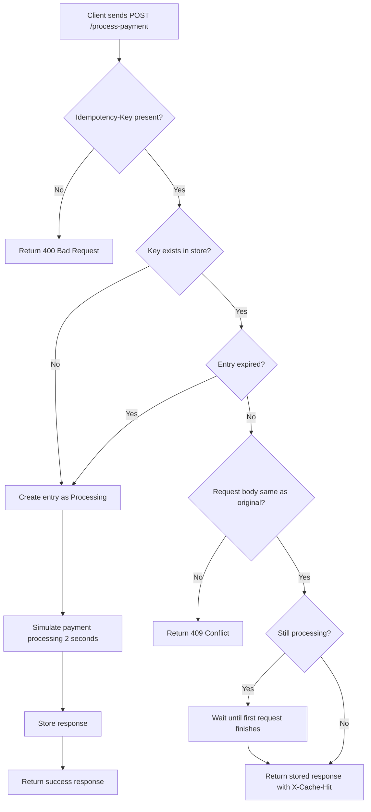

# Idempotency Gateway (The "Pay-Once" Protocol)

## Overview

This project implements an **Idempotency Layer** for a payment processing system. It ensures that **a payment request is processed exactly once**, even if the same request is sent multiple times due to network retries, timeouts, or client errors.

This system mimics a real-world fintech backend and prevents **double charging**, a common problem in distributed systems.

The API accepts payment requests and uses an **Idempotency-Key** provided in the HTTP header to determine whether the request is new, duplicated, or invalid.

---

## Business Problem

Payment clients (e-commerce platforms) may retry requests when they do not receive a timely response from the server. Without protection, the payment processor may treat each retry as a new request and charge the customer multiple times.

This system prevents that by:

* Processing a request only once
* Returning stored responses for duplicate requests
* Rejecting misuse of idempotency keys
* Handling concurrent identical requests safely

---

## Architecture Diagram (Flowchart)



---

## Technology Stack

* Language: C#
* Framework: ASP.NET Core Web API (.NET 8)
* Storage: In-memory Concurrent Dictionary
* Serialization: System.Text.Json
* Hashing: SHA256

No external database is required.

---

## Project Structure

```
IdempotencyGateway
│
├── Controllers
│   └── PaymentController.cs
│
├── Models
│   ├── PaymentRequest.cs
│   └── PaymentResponse.cs
│
├── Services
│   ├── IdempotencyEntry.cs
│   └── IdempotencyService.cs
│
└── Program.cs
```

---

## Setup Instructions

### 1. Prerequisites

Install the following:

* .NET 8 SDK
* Visual Studio 2022 (or VS Code)
* Git
* Postman (for testing)

Verify installation:

```
dotnet --version
```

---

### 2. Clone Repository

```
git clone <your-fork-url>
cd IdempotencyGateway
```

---

### 3. Run the Application

Using terminal:

```
dotnet run
```

Or press **Run** in Visual Studio.

Server starts on:

```
http://localhost:5000
```

---

## API Documentation

### Endpoint

```
POST /process-payment
```

---

### Required Header

```
Idempotency-Key: <unique-string>
```

This uniquely identifies a request.

---

### Request Body

```json
{
  "amount": 100,
  "currency": "GHS"
}
```

---

### Success Response

```
200 OK
```

```json
{
  "message": "Charged 100 GHS",
  "processedAt": "2026-01-01T12:00:00Z"
}
```

---

## Behaviour Scenarios

### 1. First Request

* Payment is processed
* 2-second simulated delay
* Response stored

---

### 2. Duplicate Request (Same Key + Same Body)

* No reprocessing
* Stored response returned immediately
* Response header included:

```
X-Cache-Hit: true
```

---

### 3. Same Key With Different Body

Example: amount changes from 100 to 500

Response:

```
409 Conflict
```

Message:

```
Idempotency key already used for a different request body.
```

---

### 4. Concurrent Requests (Race Condition Handling)

If two identical requests arrive at the same time:

* Second request waits
* Only one payment is processed
* Both receive identical result

---

## Design Decisions

### In-Memory Store

A Concurrent Dictionary is used because:

* Thread-safe
* Fast lookups
* Simple implementation
* No external dependencies

---

### Request Body Hashing

SHA256 hash ensures:

* Accurate comparison of request payloads
* Prevents fraud or misuse of keys

---

### Processing State Tracking

Each request entry stores:

* Processing status
* Response
* Timestamp
* Waiting mechanism for concurrent requests

This prevents duplicate execution and race conditions.

---

## Developer's Choice Feature

### Idempotency Key Expiration (TTL)

#### What It Does

Each idempotency key is valid for a limited time (10 minutes).

After expiration:

* Key is removed automatically
* Same key can be reused as new request

---

#### Why This Is Important

Real-world payment systems cannot store keys forever because:

* Memory usage grows continuously
* Security risks increase
* Long-term caching is unnecessary

TTL ensures:

* Memory control
* Better performance
* Realistic fintech behaviour

---

## Error Handling

| Situation                      | Response        |
| ------------------------------ | --------------- |
| Missing header                 | 400 Bad Request |
| Key reused with different data | 409 Conflict    |
| Normal success                 | 200 OK          |

---

## Testing With Postman

### First Request

POST

```
http://localhost:5000/process-payment
```

Header:

```
Idempotency-Key: abc123
```

Body:

```json
{
  "amount": 100,
  "currency": "GHS"
}
```

Wait 2 seconds → success.

---

### Duplicate Request

Send same request again.

Expected:

* Instant response
* X-Cache-Hit header

---

### Fraud Test

Same key but change amount.

Expected:

409 Conflict

---

## Performance Characteristics

* O(1) lookup time
* Thread-safe concurrency
* Non-blocking waiting mechanism

---

## How Idempotency Is Achieved

1. Client sends unique key
2. System stores request hash + response
3. Future requests checked against store
4. Matching request returns stored result

This guarantees **exactly-once execution**.

---


---

## Author

Ebenezer Acquah

---

## Final Notes

This system demonstrates:

* Backend API design
* Concurrency control
* Distributed systems principles
* Financial transaction safety
* Clean architecture

It simulates real-world fintech idempotency handling in a simple and understandable implementation.
